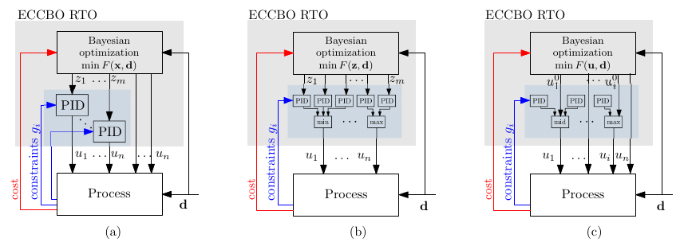

# ECCBO: Embedded Constraint Control with Bayesian Optimization

This repository provides Python code for demonstrating the **Embedded Constraint Control with Bayesian Optimization (ECCBO)** framework, as introduced in our paper:

> **[ECCBO: An Inherently Safe Bayesian Optimization with Embedded Constraint Control for Real-time Process Optimization]**  
> *Dinesh Krishnamoorthy*  
> Submitted to the Journal of Process Control & IFAC ADCHEM 2024
> https://arxiv.org/pdf/2402.18415

  

## Highlights

-	A model-free RTO framework, that embeds Bayesian optimization with constraint control, ensuring no steady-state violations.
-	Efficient handling of unknown constraints by combining process control concepts with Bayesian optimization.
-	Unknown constraints managed without relying on additional probabilistic surrogate models, and their associated assumptions.
-	Demonstrated across different benchmark case studies.

Requires GPy package (https://sheffieldml.github.io/GPy/) 

